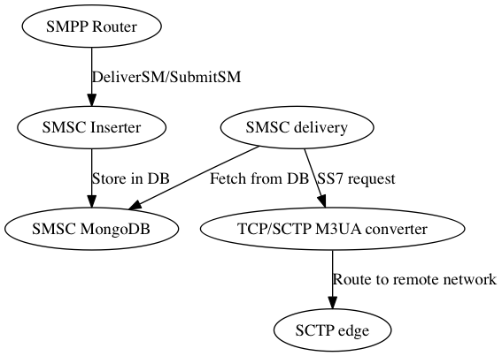

= SMSC - Scalable Smalltalk Short Message Center - User Manaul
Holger Hans Peter Freyther <holger@moiji-mobile.com>

== Introduction

The OsmoSMSC is a scalable Short Message Center implemented using the
Pharo Object Environment and MongoDB. Commercial support for deployment,
maintenance and extensions is available through
link:http://moiji-mobile.com[moiji-mobile]. Please contact
help@moiji-mobile.com.

The system consists out of four parts that handle different aspects
of the SMS processing. The first step is to configure links and routes
on the O&M component through the REST interface, the second is to insert
SMPP Deliver_SM, SMPP Submit_SM through SMPP links, the third is the
part that handles routing and delivery through SMPP and SS7 and the
fourth to expire old SMS and release SMS of failed delivery attempts.

Inserter:: Provides ESME/MC SMPP links and will store SMPP SubmitSM
and SMPP DeliverSM in the database and schedule them for delivery.

Delivery:: Will determine and route SMS through configured SMPP or
SS7 links.

O&M:: Provides a REST interface to configure SMPP links and SS7 links
for the inserter and delivery. Provides an interface to query about
the number of queued SMS, failed attempts and more.

GC:: Expire old queued messages based on the expiration time. Help
to clean-up delivery of SMS that got stuck due programming errors
on delivery.

include::inserter.asciidoc[]

include::delivery.asciidoc[]

include::gc.asciidoc[]

include::rest.asciidoc[]

include::cli.asciidoc[]
